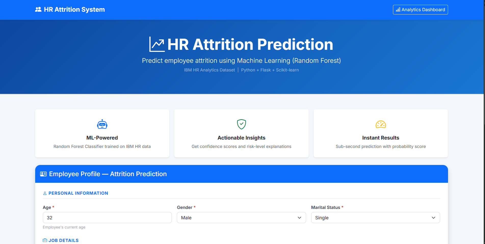

# HR Attrition Analytics & Prediction System

> **End-to-end Machine Learning web application** that predicts employee attrition using the IBM HR Analytics dataset.  
> Built with **Python · Flask · Scikit-learn · Pandas · Bootstrap**

---

## Project Description

Employee attrition — when employees voluntarily leave a company — is one of the costliest HR challenges. Replacing a single employee can cost 50–200% of their annual salary. This project uses machine learning to **predict which employees are at risk of leaving**, giving HR teams a chance to intervene proactively.

This project demonstrates:
- End-to-end ML pipeline (data → preprocessing → training → evaluation → deployment)
- Flask REST-style web application
- Professional frontend with Bootstrap
- Data visualisation and EDA
- Model interpretability (feature importance)

---

## Features

| Feature | Details |
|---|---|
| **Dataset** | IBM HR Analytics Employee Attrition (1,470 records, 35 features) |
| **Models** | Logistic Regression, Decision Tree, Random Forest |
| **Evaluation** | Accuracy, Precision, Recall, F1 Score, Confusion Matrix, ROC Curve |
| **Web App** | Flask backend + HTML/CSS/Bootstrap frontend |
| **EDA Charts** | 6 visualisations saved to `outputs/` |
| **Model Saving** | joblib serialisation to `models/` |

---

## Project Structure

```
HR-Attrition-Analytics-System/
│
├── data/
│   ├── WA_Fn-UseC_-HR-Employee-Attrition.csv   ← Dataset (Kaggle or generated)
│   └── generate_dataset.py                       ← Synthetic data generator
│
├── models/
│   ├── random_forest.pkl                         ← Saved Random Forest
│   ├── logistic_regression.pkl                   ← Saved Logistic Regression
│   ├── decision_tree.pkl                         ← Saved Decision Tree
│   ├── scaler.pkl                                ← Fitted StandardScaler
│   ├── label_encoders.pkl                        ← Fitted LabelEncoders
│   └── feature_columns.pkl                       ← Feature column order
│
├── notebooks/
│   └── exploration.ipynb                         ← Jupyter notebook (optional)
│
├── outputs/                                      ← EDA and model charts (auto-generated)
│   ├── attrition_distribution.png
│   ├── age_vs_attrition.png
│   ├── income_vs_attrition.png
│   ├── overtime_vs_attrition.png
│   ├── department_attrition.png
│   ├── correlation_heatmap.png
│   ├── feature_importance.png
│   └── model_comparison.png
│
├── src/
│   ├── __init__.py
│   ├── preprocessing.py     ← Data loading, encoding, scaling, splitting
│   ├── train_model.py       ← Model training, evaluation, cross-validation
│   ├── predict.py           ← Single-record prediction for Flask
│   ├── eda.py               ← EDA visualisation scripts
│   └── utils.py             ← Model saving/loading, metric utilities
│
├── templates/
│   ├── index.html           ← Home page with employee input form
│   ├── result.html          ← Prediction result page
│   └── analytics.html       ← EDA dashboard page
│
├── static/
│   └── css/
│       └── style.css        ← Custom styles
│
├── app.py                   ← Flask application entry point
├── main.py                  ← Setup script (EDA + training pipeline)
├── requirements.txt         ← Python dependencies
└── README.md                ← This file
```

---

## Tech Stack

**Backend:** Python 3.10+, Flask 3.x  
**Machine Learning:** Scikit-learn, Pandas, NumPy  
**Visualisation:** Matplotlib, Seaborn  
**Frontend:** HTML5, CSS3, Bootstrap 5  
**Model Persistence:** Joblib  

---

## Setup & Installation

### 1. Clone / Download the project

```bash
git clone https://github.com/your-username/HR-Attrition-Analytics-System.git
cd HR-Attrition-Analytics-System
```

### 2. Create a virtual environment (recommended)

```bash
python -m venv venv

# Windows
venv\Scripts\activate

```

### 3. Install dependencies

```bash
pip install -r requirements.txt
```

### 4. (Optional) Use the real Kaggle dataset

Download the dataset from Kaggle:  
[IBM HR Analytics Employee Attrition & Performance](https://www.kaggle.com/datasets/pavansubhasht/ibm-hr-analytics-attrition-dataset)

Place the file at:
```
data/WA_Fn-UseC_-HR-Employee-Attrition.csv
```

### 5. Run the setup pipeline (EDA + model training)

```bash
python main.py
```

This will:
- Run Exploratory Data Analysis and save all charts to `outputs/`
- Train Logistic Regression, Decision Tree, and Random Forest models
- Save trained models to `models/`

### 6. Start the Flask web application

```bash
python app.py
```

Open your browser at: **http://127.0.0.1:5000**

---

## How to Use the Web App

1. **Home Page (`/`)** — Fill in the employee profile form:
   - Age, Monthly Income, Overtime, Job Satisfaction
   - Department, Work-Life Balance, Environment Satisfaction
   - Tenure details, travel frequency, etc.

2. **Click "Predict Attrition"** — The model processes the input and returns:
   - **Prediction**: Likely to Leave / Not Likely to Leave
   - **Attrition probability** (0–100%)
   - **Risk Level**: High / Medium / Low
   - **Explanation**: Key contributing factors

3. **Analytics Dashboard (`/analytics`)** — View all EDA charts and model performance visualisations

---

## ML Pipeline Overview

```
Raw CSV Dataset
      ↓
Drop useless columns (EmployeeCount, Over18, ...)
      ↓
Handle missing values (median / mode imputation)
      ↓
Label Encoding (categorical → numeric)
      ↓
Train-Test Split (80% / 20%, stratified)
      ↓
StandardScaler (mean=0, std=1)
      ↓
Train: Logistic Regression | Decision Tree | Random Forest
      ↓
Evaluate: Accuracy, Precision, Recall, F1, Confusion Matrix, ROC-AUC
      ↓
Save best model + scaler + encoders with joblib
      ↓
Flask app loads model → accepts form input → returns prediction
```

---

## Model Results (on synthetic data)


| Model | Accuracy | F1 Score |
|---|---|---|
| Logistic Regression | ~75% | Best recall on minority class |
| Decision Tree | ~71% | Good interpretability |
| Random Forest | ~83% | Best accuracy (biased to majority on imbalanced data) |

**Key Insight:** Because attrition is an imbalanced classification problem (~16% leave), F1 Score and Recall are more important than Accuracy.

---

## Key Attrition Predictors (from Feature Importance)

1. **OverTime** — Employees who work overtime leave far more frequently
2. **MonthlyIncome** — Lower earners are at higher risk
3. **Age** — Younger employees (20–35) have higher attrition
4. **TotalWorkingYears** — Less experienced employees are more likely to leave
5. **JobSatisfaction** — Low satisfaction strongly predicts attrition
6. **WorkLifeBalance** — Poor work-life balance increases attrition risk
7. **YearsAtCompany** — New employees (< 2 years) are most at risk

---


## Screenshots




## License

This project is for educational and portfolio purposes.  
Dataset credit: IBM / Kaggle — [IBM HR Analytics](https://www.kaggle.com/datasets/pavansubhasht/ibm-hr-analytics-attrition-dataset)